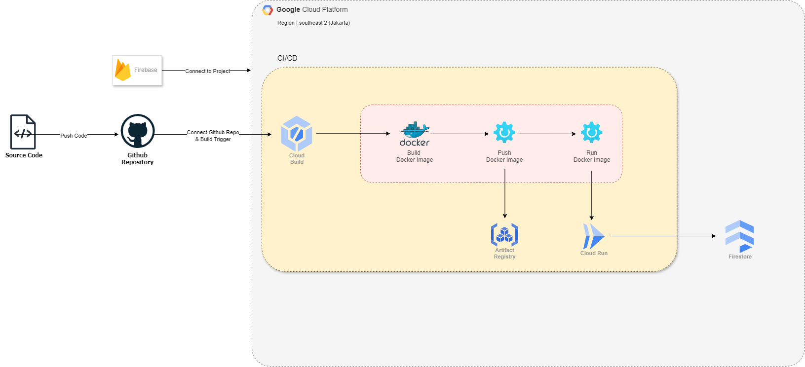

<div align="center">
<h1 align="center">Travt REST API</h1>
<p align="center">
    Back-end implementation for our application
    <br />
    <!-- <a href="https://github.com/entry-point-community/v6-app"><strong>Explore the docs »</strong></a>
    <br /> -->
    <br />
    <a href="https://github.com/suwuk/travt-api/issues">Report Bug</a>
    ·
    <a href="https://github.com/suwuk/travt-api/issues">Request Feature</a>
  </p>
</div>

<h4>Table of Contents</h4>
<ol>
  <li>
    <a href="#about-the-project">About The Project</a>
    <ul>
      <li><a href="#built-with">Built With</a></li>
      <li><a href="#cicd-environment">CI/CD Environment</a></li>
    </ul>
  </li>
 <li>
    <a href="#getting-started">Getting Started</a>
    <ul>
      <li><a href="#prerequisites">Prerequisites</a></li>
      <li><a href="#setup-and-installation">Setup and Installation</a></li>
    </ul>
 </li>
 <li><a href="#usage">Usage</a></li>
 <li><a href="#api-endpoints">API Endpoints</a></li>
 <li><a href="#reach-us">Reach us</a></li>
 <li><a href="#association">Association</a></li>
</ol>
<!-- ABOUT THE PROJECT -->

## About The Project
This repository contains Travt's back-end services, which include the necessary functionalities and operational logic to support the application's front-end. These services manage critical operations like data storage, processing, retrieval, integration with machine learning recommendation models, and provisioning APIs for seamless interaction with the front-end.

### Built With
- **ExpressJs**: Framework [ExpressJS](https://expressjs.com)
- **Python**: For Training Model Machine Learning [Python](https://www.python.org/)
- **Dotenv**: Environment variables access [dotenv](https://www.npmjs.com/package/dotenv)
- **CORS**: Cross-Origin Resource-Sharing enabled using [cors](https://github.com/expressjs/cors)
- **CI**: Continuous Integration with [Cloud Build](https://cloud.google.com/build)
- **Docker**: Containerization with [Docker](https://www.docker.com)
- **Firebase**: For Authentication, Realtime database, Firestore database, and Storage [Firebase](https://firebase.google.com/docs?hl=id)

### CI/CD Environment

For the CI/CD Environment, we use Cloud Build with push trigger. When a revision / update to the code is pushed, the diagram as shown above will run the process of revision. Below are the services we use from Google Cloud Platform to develop CI/CD pipeline :
1. Cloud Build : To create a trigger
2. Artifact Registry: For the docker images repository
3. Cloud Run: To run the application

## Getting Started
Getting started, do follow the steps below thoroughly and carefully. Make sure all the prerequisities and installations are done correctly according to

### Prerequisites

- Node js
- python, pip, venv, build-essential
- npm
  ```sh
  npm install npm@latest -g
  ```
  
### Setup and installation
#### 1. Install packages
```sh
$ python3 -m venv venv
```
```sh
$ source venv/bin/activate  
```
```sh
$ pip install --upgrade pip
```
```sh
$ pip install numpy h5py tensorflow
```
```sh
$ npm install
```

#### 2. Setting up .env file
the `.env` file has been created, you just need to customize it

#### 3. Running server
```sh
$ npm run start
```

## Usage
REST API is used for Travt Application front-end

## API Endpoints
List of available routes:

**Destinations**:\
`GET /destination` - get all destinations\
`GET /destination/popular` - get popular destinations\
`GET /destination/:place_id` - get detail destinations by id\
`GET /recommendation` - get recommendations\

**Favorite**:\
`POST /destination/:place_id/favorite` - add destination favorite\
`GET /favorite` - get favorite destination\
`DELETE /destination/:place_id/favorite` - delete destination favorite\


**Review**:\
`POST /destination/:place_id/review/create` - create review\
`GET /review/history` - get history review user\

## Reach us
- Diaz Aditya Yudha - [LinkedIn](https://www.linkedin.com/in/diaz-aditya-yudha/)
- Arjun Nourmansyah Ramdani - [LinkedIn](https://www.linkedin.com/in/arjunnourmansyahramdani/)


## Association
- [Bangkit](https://grow.google/intl/id_id/bangkit)
